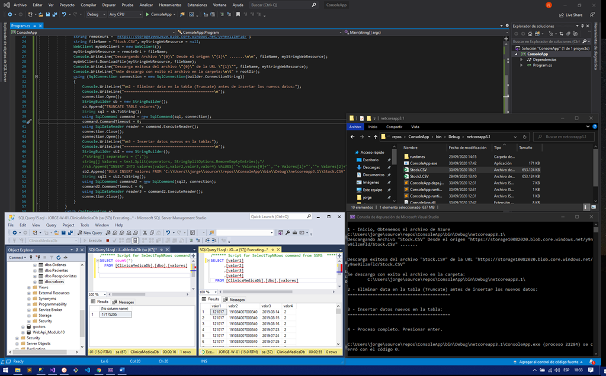

# PruebaAA-C-digo-
Evaluacion jessica.gonzalez@analyticalways.com

Existen dos opciones Desarrolladas:

1. Codigo sin comentar, se hace la descarga del CSV, se vacia la tabla valores y por ultimo se hace el bulk insert en la 
BD local del archivo CSV descargado en la ubicacion local.

2. Codigo comentado, Se lee directamente el archivo sin ser descargado, se hace un Truncate de la tabla valores y se 
procede a insertar linea por linea en la base de datos local.

DECISION: la opcion 1 debido a que le doy la responsabilidad a sql server para que haga el bulk insert de manera 
eficiente por la cantidad IMPORTANTE de registros. Laopcion 2 por el contrario me demoro mas tiempo en procesar por 
generar cada inserto por linea desde el bucle con C#.

Test Result:

Resultado final de la prueba en 42 Minutos. (37 minutos descargando el archivo y 5 minutos bulk insert).

           

